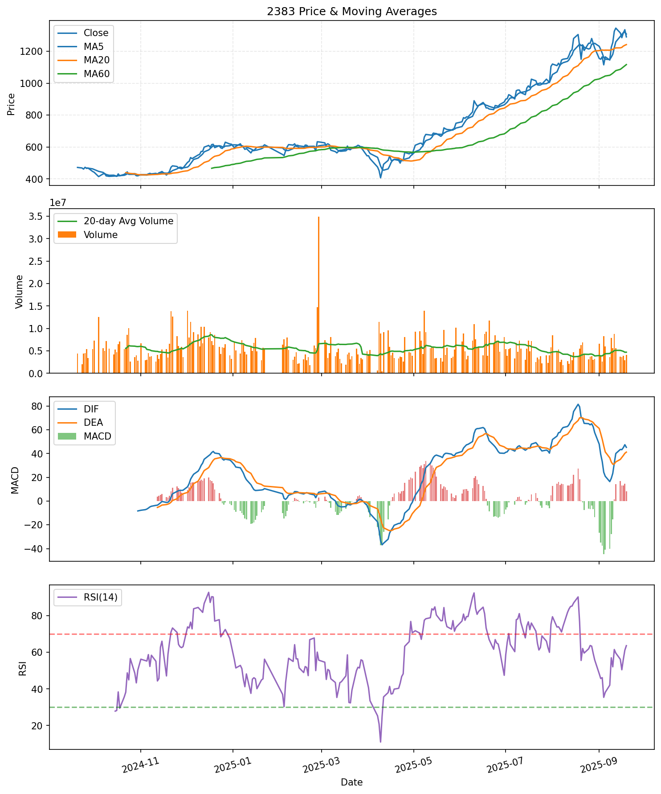
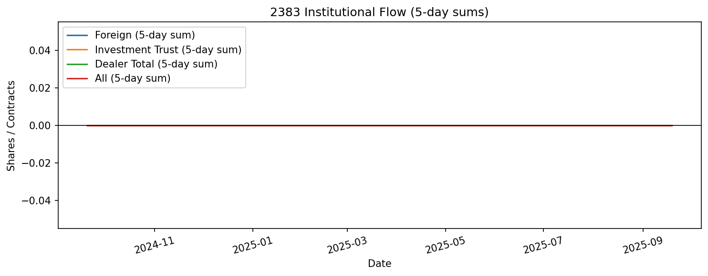

# 2383 個股分析（2025-09-19）

## 分數總覽
| 面向 | 分數 |
| --- | ---: |
| 技術面 | 3.80 |
| 籌碼面 | 2.50 |
| 資金面 | 1.80 |
| 基本面 | 0.00 |
| 總分 | 8.10 |

## 投資建議摘要
- 建議：中性觀望/區間操作
- 趨勢分類：Up
- 籌碼觀察：法人動向無明顯連續趨勢
- 理由整理：均線多頭排列；基本面資料不足，建議另行查證；法人動向無明顯連續趨勢

## 技術面觀察
- 均線與趨勢斜率：觀察 MA20 與 MA60 的方向，正斜率代表趨勢向上。
- MACD：DIF 與 DEA 正交叉代表多方動能，負交叉需留意回檔。
- RSI：70 以上過熱、30 以下過冷，搭配布林帶判斷反轉。

## 籌碼面觀察
- 三大法人近 5 日合計：0
- 外資近 5 日：0
- 投信近 5 日：0
- 自營商近 5 日：0
- 籌碼摘要：法人動向無明顯連續趨勢

## 資金面觀察
- 成交金額分位數：0.69
- 成交金額變化（5 日）：12.75%
- 成交量變化（5 日）：12.88%
- 成交筆數變化（5 日）：29.21%

## 基本面觀察
- 評語：基本面資料不足

## 圖表

## 指標說明
- MA：簡單移動平均，反映趨勢方向。
- EMA：指數平均，較重視近期價格。
- MACD：動能指標，柱狀體由 DIF 與 DEA 差值乘以 2。
- RSI：相對強弱指數，常用 14 日衡量超買超賣。
- 布林帶：以 20 日均線為中心 ±2 倍標準差。
- 量能：以 20 日均量為基礎衡量放量或縮量。
- 法人累計：統計外資、投信、自營商近 5/10/20 日動向。
